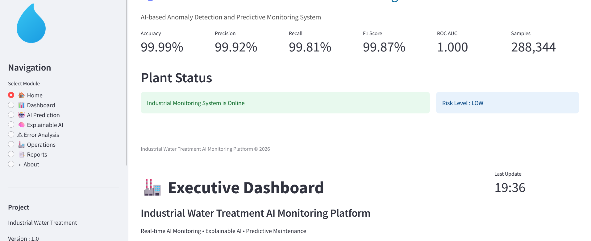

# AI-Based Anomaly Detection and Predictive Monitoring for Industrial Water Treatment Systems

## Overview

Industrial systems generate massive amounts of sensor data every day. 
Monitoring these signals manually is challenging and early detection of abnormal behavior is critical for reducing downtime and improving operational safety.

This project presents an end-to-end Artificial Intelligence solution for detecting anomalies and monitoring industrial processes using Machine Learning and Explainable AI techniques.

The project demonstrates the complete lifecycle of an Industrial AI system:

- Data Processing
- Exploratory Data Analysis
- Feature Engineering
- Machine Learning Modeling
- Model Evaluation
- Explainable AI
- Interactive Industrial Dashboard
- Deployment

---

# Problem Statement

In industrial environments, unexpected equipment behavior can lead to:

- Production downtime
- Equipment damage
- Increased maintenance costs
- Safety risks

Traditional monitoring systems often detect problems after failure occurs.

The goal of this project is to develop an AI-powered monitoring system capable of:

- Detecting abnormal patterns
- Estimating risk levels
- Explaining model decisions
- Supporting industrial decision-making

---

# Solution Architecture

Industrial Data
|
|
Data Processing
|
|
Feature Engineering
|
|
Machine Learning Models
|
|
Anomaly Detection
|
|
Explainable AI (SHAP)
|
|
Interactive Dashboard

---

# Dataset

This project uses the SWaT (Secure Water Treatment) industrial dataset.

Characteristics:

- Industrial control system data
- Multiple sensor measurements
- Normal operation samples
- Attack / abnormal scenarios
- Large-scale time-series records

---

# Machine Learning Models

Several algorithms were evaluated:

## Isolation Forest

Used for unsupervised anomaly detection.

Advantages:

- Efficient on large datasets
- Suitable for rare anomaly detection
- Does not require labeled failure examples

## Random Forest

Used for classification and performance comparison.

## XGBoost

A powerful gradient boosting algorithm for complex patterns.

## LightGBM

Optimized gradient boosting model suitable for large datasets.

---

# Explainable AI

A major challenge in industrial AI is trust.

The project uses SHAP (SHapley Additive exPlanations) to answer:

- Why was this sample classified as abnormal?
- Which sensors contributed the most?
- What factors increased the risk?

---

# Industrial Dashboard

A complete Streamlit dashboard was developed.

The dashboard provides:

## Monitoring

- System status
- Risk level
- Prediction results

## Analytics

- Model performance
- Probability distribution
- Anomaly statistics

## Explainability

- SHAP Feature Importance
- Feature Contribution Analysis

## Reporting

- Exportable reports
- Decision support information

---

# Project Structure

app/
Streamlit dashboard application

notebooks/
Complete ML development pipeline

models/
Trained machine learning models

results/
Evaluation results and predictions

figures/
Project visualizations

deployment/
Deployment configuration

---

# Technologies

Python

Pandas

NumPy

Scikit-learn

XGBoost

LightGBM

SHAP

Plotly

Streamlit

Joblib

---

# Results

The project successfully demonstrates:

✔ End-to-end Industrial AI workflow

✔ Automated anomaly detection

✔ Model comparison

✔ Explainable predictions

✔ Interactive monitoring dashboard

---

# Future Improvements

Future industrial deployment can include:

- Real-time sensor streaming
- PLC / SCADA integration
- IoT connectivity
- Cloud deployment
- MLOps pipeline
- Edge AI implementation

---

# Author

Hamid Saeli

Machine Learning Engineer

GitHub:
https://github.com/HamidSaeli

LinkedIn:
(Add your LinkedIn link)

---

# Disclaimer

This project is a Proof-of-Concept demonstrating an Industrial AI workflow.
Real-world deployment requires integration with industrial infrastructure and real-time data pipelines.